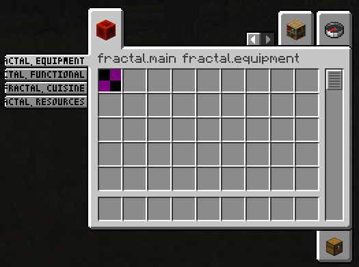
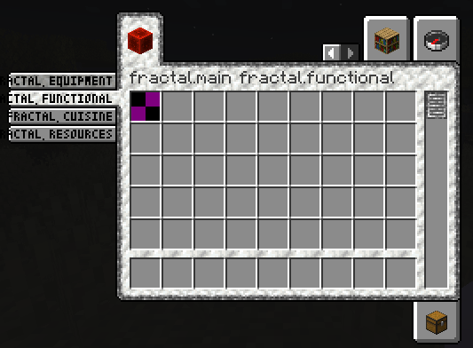

# About Fractal

This repo is a fork of [DaFuqs/fractal](https://github.com/dafuqs/fractal) by
DaFuqs which is a fork of [lib39/fractal](https://git.sleeping.town/unascribed-mods/Lib39)
by unascribed.

Fractal introduces item **subgroups for the creative menu**.

## Differences from Upstream

- NeoForge
- Some classes are renamed to fit more with Mojmaps
- That's pretty much it!

### Why Fractal?

- Fractals Subgroups are very condensed, allowing you to add up to 12 subgroups
  for each of your tabs.
- Creating a new `CreativeSubTab` only takes one line of code and no changes in
  the way you assign your items to groups. Just pass them the `CreativeSubTab`
  instead of your main item group.

### Limitations

- More than 12 subgroups per item group, while fully functional, will look weird.
- The tiny font used for the labels does not support full Unicode.

## Examples

### Vanilla Style Subgroups



```java
// Create our parent creative tab
public static final CreativeModeTab TAB = CreativeModeTab.builder()
		.icon(() -> new ItemStack(Blocks.REDSTONE_BLOCK))
		.displayItems((displayContext, entries) ->
		{
			// At least one item must be added to the parent tab or else it won't be visible.
			// Make sure that this item isn't in one of your subtabs, otherwise you'll get an error about duplicate items in a tab.
			entries.accept(Items.APPLE, CreativeModeTab.TabVisibility.PARENT_TAB_ONLY);

			// Add all of our subgroup's items to the parent tab.
			for (CreativeSubTab subGroup : MyMod.TAB.fractal$getChildren())
			{
				entries.acceptAll(subGroup.getSearchTabDisplayItems(), CreativeModeTab.TabVisibility.SEARCH_TAB_ONLY);
			}
		})
		.title(Component.translatable("itemGroup.mymod.main"))
		.build();

// Create a subtab for the basic redstone things.
public static final CreativeModeTab REDSTONE = new CreativeSubTab.Builder(
	TAB, // This is the parent tab we're registering the subtab to.
	id("redstone"),
	Component.translatable("itemGroup.mymod.redstone")
)
	.entries((displayContext, entries) -> {
		entries.accept(Items.REDSTONE);
		entries.accept(Items.REDSTONE_TORCH);
		entries.accept(Items.REDSTONE_BLOCK);
		entries.accept(Items.REPEATER);
		entries.accept(Items.COMPARATOR);
		entries.accept(Items.REDSTONE_ORE);
	})
	.build();
public static final CreativeModeTab LOGISTICS = new CreativeSubTab.Builder(
	TAB,
    id("logistics"),
    Component.translatable("itemGroup.fractal.logistics")
)
	.entries((displayContext, entries) -> {
		entries.accept(Items.DISPENSER);
		entries.accept(Items.DROPPER);
		entries.accept(Items.HOPPER);
		entries.accept(Items.RAIL);
		entries.accept(Items.POWERED_RAIL);
		entries.accept(Items.DETECTOR_RAIL);
		entries.accept(Items.ACTIVATOR_RAIL);
		entries.accept(Items.MINECART);
		entries.accept(Items.HOPPER_MINECART);
		entries.accept(Items.CHEST_MINECART);
		entries.accept(Items.FURNACE_MINECART);
		entries.accept(Items.TNT_MINECART);
		entries.accept(Items.OAK_CHEST_BOAT);
		entries.accept(Items.BAMBOO_CHEST_RAFT);
	})
	.build();

public static final DeferredRegister<CreativeModeTab> TABS = DeferredRegister.create(Registries.CREATIVE_MODE_TAB, "mymod");

public FractalTestMod(IEventBus modBus)
{
	TABS.register("tab", () -> TAB);
	TABS.register(modBus);
}
```

### Applying a custom style

You are also able to apply a style to your `CreativeSubTab`s, by supplying
custom background, tab, subtab and scrollbar textures. You can even mix and
match!

In this example, the first two `CreativeSubTab`s use a custom style by
supplying texture files that are being shipped with your mod. The latter two
tabs use the vanilla style.



```java
ResourceLocation id(String path)
{
	return ResourceLocation.fromNamespaceAndPath("mymod", path);
}

// Texture (put into resources/assets/mymod/textures/gui/container/creative_inventory)
public static final ResourceLocation BACKGROUND_TEXTURE = id("textures/gui/container/creative_inventory/custom_background.png");

// Sprites (put into resources/assets/mymod/textures/gui/sprites/container/creative_inventory)
public static final ResourceLocation SCROLLBAR_ENABLED_TEXTURE = id("container/creative_inventory/custom_scrollbar_enabled");
public static final ResourceLocation SCROLLBAR_DISABLED_TEXTURE = id("container/creative_inventory/custom_scrollbar_disabled");

public static final ResourceLocation SUBTAB_SELECTED_TEXTURE_LEFT = id("container/creative_inventory/custom_subtab_selected_left");
public static final ResourceLocation SUBTAB_UNSELECTED_TEXTURE_LEFT = id("container/creative_inventory/custom_subtab_unselected_left");
public static final ResourceLocation SUBTAB_SELECTED_TEXTURE_RIGHT = id("container/creative_inventory/custom_subtab_selected_right");
public static final ResourceLocation SUBTAB_UNSELECTED_TEXTURE_RIGHT = id("container/creative_inventory/custom_subtab_unselected_right");

public static final ResourceLocation TAB_TOP_FIRST_SELECTED_TEXTURE = id("container/creative_inventory/custom_tab_top_first_selected");
public static final ResourceLocation TAB_TOP_SELECTED_TEXTURE = id("container/creative_inventory/custom_tab_top_selected");
public static final ResourceLocation TAB_TOP_LAST_SELECTED_TEXTURE = id("container/creative_inventory/custom_tab_top_last_selected");
public static final ResourceLocation TAB_TOP_FIRST_UNSELECTED_TEXTURE = id("container/creative_inventory/custom_tab_top_first_unselected");
public static final ResourceLocation TAB_TOP_UNSELECTED_TEXTURE = id("container/creative_inventory/custom_tab_top_unselected");
public static final ResourceLocation TAB_TOP_LAST_UNSELECTED_TEXTURE = id("container/creative_inventory/custom_tab_top_last_unselected");
public static final ResourceLocation TAB_BOTTOM_FIRST_SELECTED_TEXTURE = id("container/creative_inventory/custom_tab_bottom_first_selected");
public static final ResourceLocation TAB_BOTTOM_SELECTED_TEXTURE = id("container/creative_inventory/custom_tab_bottom_selected");
public static final ResourceLocation TAB_BOTTOM_LAST_SELECTED_TEXTURE = id("container/creative_inventory/custom_tab_bottom_last_selected");
public static final ResourceLocation TAB_BOTTOM_FIRST_UNSELECTED_TEXTURE = id("container/creative_inventory/custom_tab_bottom_first_unselected");
public static final ResourceLocation TAB_BOTTOM_UNSELECTED_TEXTURE = id("container/creative_inventory/custom_tab_bottom_unselected");
public static final ResourceLocation TAB_BOTTOM_LAST_UNSELECTED_TEXTURE = id("container/creative_inventory/custom_tab_bottom_last_unselected");

public static final CreativeSubTabStyle STYLE = new CreativeSubTabStyle.Builder()
        .background(BACKGROUND_TEXTURE)
        .scrollbar(SCROLLBAR_ENABLED_TEXTURE, SCROLLBAR_DISABLED_TEXTURE)
        .subtab(SUBTAB_SELECTED_TEXTURE_LEFT, SUBTAB_UNSELECTED_TEXTURE_LEFT, SUBTAB_SELECTED_TEXTURE_RIGHT, SUBTAB_UNSELECTED_TEXTURE_RIGHT)
        .tab(TAB_TOP_FIRST_SELECTED_TEXTURE, TAB_TOP_SELECTED_TEXTURE, TAB_TOP_LAST_SELECTED_TEXTURE, TAB_TOP_FIRST_UNSELECTED_TEXTURE, TAB_TOP_UNSELECTED_TEXTURE, TAB_TOP_LAST_UNSELECTED_TEXTURE,
                TAB_BOTTOM_FIRST_SELECTED_TEXTURE, TAB_BOTTOM_SELECTED_TEXTURE, TAB_BOTTOM_LAST_SELECTED_TEXTURE, TAB_BOTTOM_FIRST_UNSELECTED_TEXTURE, TAB_BOTTOM_UNSELECTED_TEXTURE, TAB_BOTTOM_LAST_UNSELECTED_TEXTURE)
        .build();

public static final CreativeMenuTab EQUIPMENT = new CreativeSubTab.Builder(MAIN, id("equipment"), Component.translatable("itemGroup.mymod.equipment"))
        .styled(STYLE)
        .entries((displayContext, entries) -> entries.add(Items.APPLE))
        .build();
public static final CreativeMenuTab FUNCTIONAL = new CreativeSubTab.Builder(MAIN, id("functional"), Component.translatable("itemGroup.mymod.functional"))
        .styled(STYLE)
        .entries((displayContext, entries) -> entries.add(Items.BAKED_POTATO))
        .build();
public static final CreativeMenuTab CUISINE = new CreativeSubTab.Builder(MAIN, id("cuisine"), Component.translatable("itemGroup.mymod.cuisine"))
        .entries((displayContext, entries) -> entries.add(Items.CACTUS))
        .build();
public static final CreativeMenuTab RESOURCES = new CreativeSubTab.Builder(MAIN, id("resources"), Component.translatable("itemGroup.mymod.resources"))
        .entries((displayContext, entries) -> entries.add(Items.DANDELION))
        .build();
```

### Test Mod

There's a test mod source set at `src/test/` which goes over most features in
Fractal. You can run it using `gradlew runTestmodClient`.

## Todo

- [ ] Add test for CreativeSubTabEvent
- [x] JEI and REI integration
